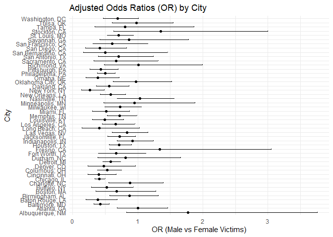
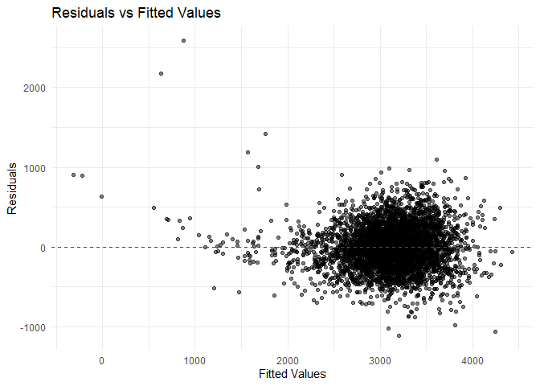

p8105_hw6_fl2714
================
Fangchi
2024-11-26

``` r
library(tidyverse)
```

    ## ── Attaching core tidyverse packages ──────────────────────── tidyverse 2.0.0 ──
    ## ✔ dplyr     1.1.4     ✔ readr     2.1.5
    ## ✔ forcats   1.0.0     ✔ stringr   1.5.1
    ## ✔ ggplot2   3.5.1     ✔ tibble    3.2.1
    ## ✔ lubridate 1.9.3     ✔ tidyr     1.3.1
    ## ✔ purrr     1.0.2     
    ## ── Conflicts ────────────────────────────────────────── tidyverse_conflicts() ──
    ## ✖ dplyr::filter() masks stats::filter()
    ## ✖ dplyr::lag()    masks stats::lag()
    ## ℹ Use the conflicted package (<http://conflicted.r-lib.org/>) to force all conflicts to become errors

``` r
library(modelr)
library(mgcv)
```

    ## 载入需要的程序包：nlme
    ## 
    ## 载入程序包：'nlme'
    ## 
    ## The following object is masked from 'package:dplyr':
    ## 
    ##     collapse
    ## 
    ## This is mgcv 1.9-1. For overview type 'help("mgcv-package")'.

``` r
library(dplyr)
library(ggplot2)
library(purrr)
library(tidyr)
library(rsample)
```

    ## Warning: 程序包'rsample'是用R版本4.4.2 来建造的

### Problem 2

``` r
# load data
url <- "https://raw.githubusercontent.com/washingtonpost/data-homicides/master/homicide-data.csv"
homicide_data <- read.csv(url, stringsAsFactors = FALSE)
```

``` r
cleaned_data <- homicide_data %>%
  mutate(city_state = paste(city, state, sep = ", ")) %>% # create variable
  mutate(solved_binary = ifelse(disposition == "Closed by arrest", 1, 0)) %>% # whether the homicide is solved
  filter(!city_state %in% c("Dallas, TX", "Phoenix, AZ", "Kansas City, MO", "Tulsa, AL")) %>%
  filter(victim_race %in% c("White", "Black")) %>% #  limit victim_race
  mutate(
    victim_age = ifelse(victim_age == "Unknown", NA, victim_age),  
    victim_age = as.numeric(victim_age)                            
  ) %>%
  drop_na(victim_age)  
```

``` r
baltimore_data <- cleaned_data %>%
  filter(city_state == "Baltimore, MD")

glm_baltimore <- glm(solved_binary ~ victim_age + victim_sex + victim_race,
                     data = baltimore_data, family = "binomial")

baltimore_results <- broom::tidy(glm_baltimore, exponentiate = TRUE, conf.int = TRUE)
baltimore_results %>%
  filter(term == "victim_sexMale")
```

    ## # A tibble: 1 × 7
    ##   term           estimate std.error statistic  p.value conf.low conf.high
    ##   <chr>             <dbl>     <dbl>     <dbl>    <dbl>    <dbl>     <dbl>
    ## 1 victim_sexMale    0.426     0.138     -6.18 6.26e-10    0.324     0.558

``` r
city_results <- cleaned_data %>%
  group_by(city_state) %>%
  nest() %>%  
  mutate(
    glm_fit = map(data, ~ glm(solved_binary ~ victim_age + victim_sex + victim_race,
                              data = ., family = "binomial")),
    tidy_results = map(glm_fit, ~ broom::tidy(.x, exponentiate = TRUE, conf.int = TRUE))
  ) %>%
  unnest(tidy_results) %>%  
  filter(term == "victim_sexMale") %>% 
  select(city_state, estimate, conf.low, conf.high)
```

    ## Warning: There were 43 warnings in `mutate()`.
    ## The first warning was:
    ## ℹ In argument: `tidy_results = map(glm_fit, ~broom::tidy(.x, exponentiate =
    ##   TRUE, conf.int = TRUE))`.
    ## ℹ In group 1: `city_state = "Albuquerque, NM"`.
    ## Caused by warning:
    ## ! glm.fit:拟合概率算出来是数值零或一
    ## ℹ Run `dplyr::last_dplyr_warnings()` to see the 42 remaining warnings.

``` r
city_results <- city_results %>%
  arrange(estimate) %>%
  mutate(city_state = factor(city_state, levels = city_state))  

ggplot(city_results, aes(x = city_state, y = estimate)) +
  geom_point() +
  geom_errorbar(aes(ymin = conf.low, ymax = conf.high), width = 0.2) +
  coord_flip() +
  labs(title = "Adjusted Odds Ratios (OR) by City",
       x = "City", y = "OR (Male vs Female Victims)") +
  theme_minimal()
```

<!-- -->

### Problem 3

``` r
birthweight <- read.csv("data/birthweight.csv")
```

``` r
birthweight <- birthweight %>%
  mutate(
    babysex = factor(babysex, levels = c(1, 2), labels = c("Male", "Female")),
    malform = factor(malform, levels = c(0, 1), labels = c("Absent", "Present")),
    frace = factor(frace),
    mrace = factor(mrace)
  ) %>%
  drop_na()  
```

``` r
# 假设模型：基于母亲的变量、胎长、胎龄等
model_hypothesis <- lm(bwt ~ babysex + bhead + blength + gaweeks + wtgain + smoken, data = birthweight)

# 模型摘要
summary(model_hypothesis)
```

    ## 
    ## Call:
    ## lm(formula = bwt ~ babysex + bhead + blength + gaweeks + wtgain + 
    ##     smoken, data = birthweight)
    ## 
    ## Residuals:
    ##      Min       1Q   Median       3Q      Max 
    ## -1109.32  -189.56    -9.54   173.30  2585.99 
    ## 
    ## Coefficients:
    ##                 Estimate Std. Error t value Pr(>|t|)    
    ## (Intercept)   -6133.7544    98.0549 -62.554  < 2e-16 ***
    ## babysexFemale    32.6864     8.7641   3.730 0.000194 ***
    ## bhead           138.4473     3.5416  39.092  < 2e-16 ***
    ## blength          79.8340     2.0721  38.529  < 2e-16 ***
    ## gaweeks          13.4932     1.5062   8.958  < 2e-16 ***
    ## wtgain            3.5198     0.4025   8.745  < 2e-16 ***
    ## smoken           -1.9562     0.5835  -3.353 0.000808 ***
    ## ---
    ## Signif. codes:  0 '***' 0.001 '**' 0.01 '*' 0.05 '.' 0.1 ' ' 1
    ## 
    ## Residual standard error: 283 on 4335 degrees of freedom
    ## Multiple R-squared:  0.6951, Adjusted R-squared:  0.6947 
    ## F-statistic:  1647 on 6 and 4335 DF,  p-value: < 2.2e-16

``` r
# 添加预测值和残差
birthweight <- birthweight %>%
  add_predictions(model_hypothesis, var = "pred") %>%
  add_residuals(model_hypothesis, var = "resid")

# 绘制残差与拟合值的散点图
ggplot(birthweight, aes(x = pred, y = resid)) +
  geom_point(alpha = 0.5) +
  geom_hline(yintercept = 0, color = "red", linetype = "dashed") +
  labs(title = "Residuals vs Fitted Values",
       x = "Fitted Values",
       y = "Residuals") +
  theme_minimal()
```

<!-- -->

``` r
model_main_effects <- lm(bwt ~ blength + gaweeks, data = birthweight)
summary(model_main_effects)
```

    ## 
    ## Call:
    ## lm(formula = bwt ~ blength + gaweeks, data = birthweight)
    ## 
    ## Residuals:
    ##     Min      1Q  Median      3Q     Max 
    ## -1709.6  -215.4   -11.4   208.2  4188.8 
    ## 
    ## Coefficients:
    ##              Estimate Std. Error t value Pr(>|t|)    
    ## (Intercept) -4347.667     97.958  -44.38   <2e-16 ***
    ## blength       128.556      1.990   64.60   <2e-16 ***
    ## gaweeks        27.047      1.718   15.74   <2e-16 ***
    ## ---
    ## Signif. codes:  0 '***' 0.001 '**' 0.01 '*' 0.05 '.' 0.1 ' ' 1
    ## 
    ## Residual standard error: 333.2 on 4339 degrees of freedom
    ## Multiple R-squared:  0.5769, Adjusted R-squared:  0.5767 
    ## F-statistic:  2958 on 2 and 4339 DF,  p-value: < 2.2e-16

``` r
model_interactions <- lm(bwt ~ bhead * blength * babysex, data = birthweight)
summary(model_interactions)
```

    ## 
    ## Call:
    ## lm(formula = bwt ~ bhead * blength * babysex, data = birthweight)
    ## 
    ## Residuals:
    ##      Min       1Q   Median       3Q      Max 
    ## -1132.99  -190.42   -10.33   178.63  2617.96 
    ## 
    ## Coefficients:
    ##                               Estimate Std. Error t value Pr(>|t|)    
    ## (Intercept)                 -7176.8170  1264.8397  -5.674 1.49e-08 ***
    ## bhead                         181.7956    38.0542   4.777 1.84e-06 ***
    ## blength                       102.1269    26.2118   3.896 9.92e-05 ***
    ## babysexFemale                6374.8684  1677.7669   3.800 0.000147 ***
    ## bhead:blength                  -0.5536     0.7802  -0.710 0.478012    
    ## bhead:babysexFemale          -198.3932    51.0917  -3.883 0.000105 ***
    ## blength:babysexFemale        -123.7729    35.1185  -3.524 0.000429 ***
    ## bhead:blength:babysexFemale     3.8781     1.0566   3.670 0.000245 ***
    ## ---
    ## Signif. codes:  0 '***' 0.001 '**' 0.01 '*' 0.05 '.' 0.1 ' ' 1
    ## 
    ## Residual standard error: 287.7 on 4334 degrees of freedom
    ## Multiple R-squared:  0.6849, Adjusted R-squared:  0.6844 
    ## F-statistic:  1346 on 7 and 4334 DF,  p-value: < 2.2e-16

``` r
set.seed(123)  
cv_df <- crossv_mc(birthweight, 100) %>%  
  mutate(
    train = map(train, as_tibble),
    test = map(test, as_tibble)
  )

# 在训练集上拟合模型并在测试集上评估 RMSE
cv_df <- cv_df %>%
  mutate(
    model_hypothesis = map(train, ~ lm(bwt ~ babysex + bhead + blength + gaweeks + wtgain + smoken, data = .)),
    model_main_effects = map(train, ~ lm(bwt ~ blength + gaweeks, data = .)),
    model_interactions = map(train, ~ lm(bwt ~ bhead * blength * babysex, data = .)),
    rmse_hypothesis = map2_dbl(model_hypothesis, test, ~ rmse(model = .x, data = .y)),
    rmse_main_effects = map2_dbl(model_main_effects, test, ~ rmse(model = .x, data = .y)),
    rmse_interactions = map2_dbl(model_interactions, test, ~ rmse(model = .x, data = .y))
  )
```

``` r
# 整理数据用于绘图
cv_long <- cv_df %>%
  select(starts_with("rmse")) %>%
  pivot_longer(
    cols = everything(),
    names_to = "model",
    values_to = "rmse",
    names_prefix = "rmse_"
  )

# 绘制 RMSE 分布
ggplot(cv_long, aes(x = model, y = rmse)) +
  geom_violin() +
  labs(title = "Cross-Validated RMSE for Each Model",
       x = "Model",
       y = "RMSE") +
  theme_minimal()
```

<!-- -->
