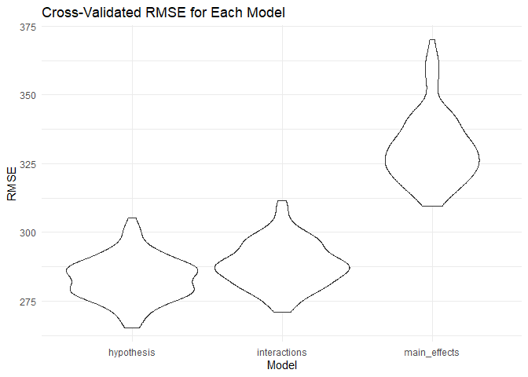

p8105_hw6_fl2714
================
Fangchi
2024-11-26

``` r
library(tidyverse)
```

    ## ── Attaching core tidyverse packages ──────────────────────── tidyverse 2.0.0 ──
    ## ✔ dplyr     1.1.4     ✔ readr     2.1.5
    ## ✔ forcats   1.0.0     ✔ stringr   1.5.1
    ## ✔ ggplot2   3.5.1     ✔ tibble    3.2.1
    ## ✔ lubridate 1.9.3     ✔ tidyr     1.3.1
    ## ✔ purrr     1.0.2     
    ## ── Conflicts ────────────────────────────────────────── tidyverse_conflicts() ──
    ## ✖ dplyr::filter() masks stats::filter()
    ## ✖ dplyr::lag()    masks stats::lag()
    ## ℹ Use the conflicted package (<http://conflicted.r-lib.org/>) to force all conflicts to become errors

``` r
library(modelr)
library(mgcv)
```

    ## 载入需要的程序包：nlme
    ## 
    ## 载入程序包：'nlme'
    ## 
    ## The following object is masked from 'package:dplyr':
    ## 
    ##     collapse
    ## 
    ## This is mgcv 1.9-1. For overview type 'help("mgcv-package")'.

``` r
library(dplyr)
library(ggplot2)
library(purrr)
library(tidyr)
library(rsample)
```

    ## Warning: 程序包'rsample'是用R版本4.4.2 来建造的

``` r
library(car)
```

    ## Warning: 程序包'car'是用R版本4.4.2 来建造的

    ## 载入需要的程序包：carData

    ## Warning: 程序包'carData'是用R版本4.4.2 来建造的

    ## 
    ## 载入程序包：'car'
    ## 
    ## The following object is masked from 'package:dplyr':
    ## 
    ##     recode
    ## 
    ## The following object is masked from 'package:purrr':
    ## 
    ##     some

### Problem 2

``` r
# load data
url <- "https://raw.githubusercontent.com/washingtonpost/data-homicides/master/homicide-data.csv"
homicide_data <- read.csv(url, stringsAsFactors = FALSE)
```

``` r
cleaned_data <- homicide_data %>%
  mutate(city_state = paste(city, state, sep = ", ")) %>% # create variable
  mutate(solved_binary = ifelse(disposition == "Closed by arrest", 1, 0)) %>% # whether the homicide is solved
  filter(!city_state %in% c("Dallas, TX", "Phoenix, AZ", "Kansas City, MO", "Tulsa, AL")) %>%
  filter(victim_race %in% c("White", "Black")) %>% # limit victim_race
  mutate(
    victim_age = ifelse(victim_age == "Unknown", NA, victim_age),  
    victim_age = as.numeric(victim_age)                            
  ) %>% # victim_age is numeric
  drop_na(victim_age)  
```

``` r
baltimore_data <- cleaned_data %>%
  filter(city_state == "Baltimore, MD")

glm_baltimore <- glm(solved_binary ~ victim_age + victim_sex + victim_race,
                     data = baltimore_data, family = "binomial")

glm_baltimore |> 
  broom::tidy(conf.int = TRUE) |> 
  mutate(OR = exp(estimate), 
         CI_low = exp(conf.low), 
         CI_high = exp(conf.high)) |>  
  select(term, log_OR = estimate, OR, p.value, CI_low, CI_high) |> 
  knitr::kable(digits = 3)
```

| term             | log_OR |    OR | p.value | CI_low | CI_high |
|:-----------------|-------:|------:|--------:|-------:|--------:|
| (Intercept)      |  0.310 | 1.363 |   0.070 |  0.976 |   1.911 |
| victim_age       | -0.007 | 0.993 |   0.043 |  0.987 |   1.000 |
| victim_sexMale   | -0.854 | 0.426 |   0.000 |  0.324 |   0.558 |
| victim_raceWhite |  0.842 | 2.320 |   0.000 |  1.650 |   3.276 |

The estimate for the adjusted odds ratio comparing male victims to
female victims is 0.426, with a 95% confidence interval of \[0.324,
0.558\], indicating that the odds of solving homicides for male victims
are significantly lower than those for female victims, controlling for
other variables.

``` r
# Group the data by city_state
results <- cleaned_data %>%
  group_by(city_state) %>% 
  nest() %>%  # Create a nested data frame for each city
  mutate(
    glm_model = map(data, ~ glm(solved_binary ~ victim_age + victim_sex + victim_race,
                                data = .x, family = "binomial")),  # Fit the logistic model for each city
    glm_tidy = map(glm_model, ~ broom::tidy(.x, conf.int = TRUE))  # Extract coefficients and CI
  ) %>%
  unnest(cols = glm_tidy) %>%  # Unnest the coefficients into a flat data frame
  filter(term == "victim_sexMale") %>%  # Select only the row for male vs female comparison
  mutate(
    OR = exp(estimate),  # Convert log(OR) to OR
    CI_low = exp(conf.low),  # Convert lower CI bound
    CI_high = exp(conf.high)  # Convert upper CI bound
  ) %>%
  select(city_state, OR, CI_low, CI_high, p.value)  # Keep relevant columns
```

    ## Warning: There were 43 warnings in `mutate()`.
    ## The first warning was:
    ## ℹ In argument: `glm_tidy = map(glm_model, ~broom::tidy(.x, conf.int = TRUE))`.
    ## ℹ In group 1: `city_state = "Albuquerque, NM"`.
    ## Caused by warning:
    ## ! glm.fit:拟合概率算出来是数值零或一
    ## ℹ Run `dplyr::last_dplyr_warnings()` to see the 42 remaining warnings.

``` r
# Display results
results %>%
  knitr::kable(digits = 3)
```

| city_state         |    OR | CI_low | CI_high | p.value |
|:-------------------|------:|-------:|--------:|--------:|
| Albuquerque, NM    | 1.767 |  0.825 |   3.762 |   0.139 |
| Atlanta, GA        | 1.000 |  0.680 |   1.458 |   1.000 |
| Baltimore, MD      | 0.426 |  0.324 |   0.558 |   0.000 |
| Baton Rouge, LA    | 0.381 |  0.204 |   0.684 |   0.002 |
| Birmingham, AL     | 0.870 |  0.571 |   1.314 |   0.511 |
| Boston, MA         | 0.674 |  0.353 |   1.277 |   0.226 |
| Buffalo, NY        | 0.521 |  0.288 |   0.936 |   0.029 |
| Charlotte, NC      | 0.884 |  0.551 |   1.391 |   0.600 |
| Chicago, IL        | 0.410 |  0.336 |   0.501 |   0.000 |
| Cincinnati, OH     | 0.400 |  0.231 |   0.667 |   0.001 |
| Columbus, OH       | 0.532 |  0.377 |   0.748 |   0.000 |
| Denver, CO         | 0.479 |  0.233 |   0.962 |   0.041 |
| Detroit, MI        | 0.582 |  0.462 |   0.734 |   0.000 |
| Durham, NC         | 0.812 |  0.382 |   1.658 |   0.576 |
| Fort Worth, TX     | 0.669 |  0.394 |   1.121 |   0.131 |
| Fresno, CA         | 1.335 |  0.567 |   3.048 |   0.496 |
| Houston, TX        | 0.711 |  0.557 |   0.906 |   0.006 |
| Indianapolis, IN   | 0.919 |  0.678 |   1.241 |   0.582 |
| Jacksonville, FL   | 0.720 |  0.536 |   0.965 |   0.028 |
| Las Vegas, NV      | 0.837 |  0.606 |   1.151 |   0.278 |
| Long Beach, CA     | 0.410 |  0.143 |   1.024 |   0.072 |
| Los Angeles, CA    | 0.662 |  0.457 |   0.954 |   0.028 |
| Louisville, KY     | 0.491 |  0.301 |   0.784 |   0.003 |
| Memphis, TN        | 0.723 |  0.526 |   0.984 |   0.042 |
| Miami, FL          | 0.515 |  0.304 |   0.873 |   0.013 |
| Milwaukee, wI      | 0.727 |  0.495 |   1.054 |   0.098 |
| Minneapolis, MN    | 0.947 |  0.476 |   1.881 |   0.876 |
| Nashville, TN      | 1.034 |  0.681 |   1.556 |   0.873 |
| New Orleans, LA    | 0.585 |  0.422 |   0.812 |   0.001 |
| New York, NY       | 0.262 |  0.133 |   0.485 |   0.000 |
| Oakland, CA        | 0.563 |  0.364 |   0.867 |   0.009 |
| Oklahoma City, OK  | 0.974 |  0.623 |   1.520 |   0.908 |
| Omaha, NE          | 0.382 |  0.199 |   0.711 |   0.003 |
| Philadelphia, PA   | 0.496 |  0.376 |   0.650 |   0.000 |
| Pittsburgh, PA     | 0.431 |  0.263 |   0.696 |   0.001 |
| Richmond, VA       | 1.006 |  0.483 |   1.994 |   0.987 |
| San Antonio, TX    | 0.705 |  0.393 |   1.238 |   0.230 |
| Sacramento, CA     | 0.669 |  0.326 |   1.314 |   0.255 |
| Savannah, GA       | 0.867 |  0.419 |   1.780 |   0.697 |
| San Bernardino, CA | 0.500 |  0.166 |   1.462 |   0.206 |
| San Diego, CA      | 0.413 |  0.191 |   0.830 |   0.017 |
| San Francisco, CA  | 0.608 |  0.312 |   1.155 |   0.134 |
| St. Louis, MO      | 0.703 |  0.530 |   0.932 |   0.014 |
| Stockton, CA       | 1.352 |  0.626 |   2.994 |   0.447 |
| Tampa, FL          | 0.808 |  0.340 |   1.860 |   0.619 |
| Tulsa, OK          | 0.976 |  0.609 |   1.544 |   0.917 |
| Washington, DC     | 0.690 |  0.465 |   1.012 |   0.061 |

``` r
# Create the data for plotting
plot_data <- results %>%  
  arrange(OR) %>%  # Arrange cities by OR
  mutate(city_state = factor(city_state, levels = city_state))  

# Plot the ORs and CIs using ggplot
ggplot(plot_data, aes(x = city_state, y = OR)) +
  geom_point(size = 3) +  
  geom_errorbar(aes(ymin = CI_low, ymax = CI_high), width = 0.2) + 
  coord_flip() +  # Flip coordinates for better readability
  theme_minimal() +  # Use a minimal theme
  labs(
    title = "Adjusted Odds Ratios (OR) and Confidence Intervals (CI) by City",
    x = "City",
    y = "Adjusted Odds Ratio (OR)"
  ) +
  geom_hline(yintercept = 1, linetype = "dashed", color = "red") +  # Add a reference line at OR = 1
  theme(
    axis.text.y = element_text(size = 8), 
    axis.text.x = element_text(size = 8)
  )
```

<!-- -->
General Trend: In most cities, male victims are less likely to have
their homicides solved compared to female victims (OR \< 1). Statistical
Significance: Cities like Baltimore, MD and Atlanta, GA show significant
effects with confidence intervals entirely below 1, indicating a strong
association. Variability: Some cities show no significant difference (OR
≈ 1), while a few have OR \> 1 with wide confidence intervals,
suggesting uncertainty or smaller sample sizes.

### Problem 3

``` r
# Load and clean the data

birthweight <- read.csv("data/birthweight.csv")

birthweight <- birthweight %>%
  mutate(
    babysex = factor(babysex, levels = c(1, 2), labels = c("Male", "Female")),
    malform = factor(malform, levels = c(0, 1), labels = c("Absent", "Present")),
    frace = factor(frace),
    mrace = factor(mrace)
  ) %>%
  drop_na()  
```

``` r
model_hypothesis <- lm(bwt ~ babysex + bhead + blength + gaweeks + wtgain + smoken, data = birthweight)
summary(model_hypothesis)
```

    ## 
    ## Call:
    ## lm(formula = bwt ~ babysex + bhead + blength + gaweeks + wtgain + 
    ##     smoken, data = birthweight)
    ## 
    ## Residuals:
    ##      Min       1Q   Median       3Q      Max 
    ## -1109.32  -189.56    -9.54   173.30  2585.99 
    ## 
    ## Coefficients:
    ##                 Estimate Std. Error t value Pr(>|t|)    
    ## (Intercept)   -6133.7544    98.0549 -62.554  < 2e-16 ***
    ## babysexFemale    32.6864     8.7641   3.730 0.000194 ***
    ## bhead           138.4473     3.5416  39.092  < 2e-16 ***
    ## blength          79.8340     2.0721  38.529  < 2e-16 ***
    ## gaweeks          13.4932     1.5062   8.958  < 2e-16 ***
    ## wtgain            3.5198     0.4025   8.745  < 2e-16 ***
    ## smoken           -1.9562     0.5835  -3.353 0.000808 ***
    ## ---
    ## Signif. codes:  0 '***' 0.001 '**' 0.01 '*' 0.05 '.' 0.1 ' ' 1
    ## 
    ## Residual standard error: 283 on 4335 degrees of freedom
    ## Multiple R-squared:  0.6951, Adjusted R-squared:  0.6947 
    ## F-statistic:  1647 on 6 and 4335 DF,  p-value: < 2.2e-16

This model is based on hypothesized factors known to influence
birthweight, supported by biological and clinical evidence:

babysex: Male babies typically have higher birthweight than female
babies bhead (head circumference): A direct indicator of the baby’s size
blength (length): size-related factor correlated with birthweight
gaweeks (gestational age): Longer gestation often leads to higher
birthweight wtgain (maternal weight gain): Reelated to maternal health
and nutrition during pregnancy smoken (maternal smoking): Smoking
restricts fetal growth

These variables were chosen based on domain knowledge about the factors
influencing birthweight.

``` r
vif(model_hypothesis)
```

    ##  babysex    bhead  blength  gaweeks   wtgain   smoken 
    ## 1.040432 1.785757 1.726263 1.223883 1.051873 1.012770

``` r
birthweight <- birthweight %>%
  add_predictions(model_hypothesis, var = "pred") %>%
  add_residuals(model_hypothesis, var = "resid")

ggplot(birthweight, aes(x = pred, y = resid)) +
  geom_point(alpha = 0.5) +
  geom_hline(yintercept = 0, color = "red", linetype = "dashed") +
  labs(title = "Residuals vs Fitted Values",
       x = "Fitted Values",
       y = "Residuals") +
  theme_minimal()
```

<!-- -->

``` r
model_main_effects <- lm(bwt ~ blength + gaweeks, data = birthweight)
summary(model_main_effects)
```

    ## 
    ## Call:
    ## lm(formula = bwt ~ blength + gaweeks, data = birthweight)
    ## 
    ## Residuals:
    ##     Min      1Q  Median      3Q     Max 
    ## -1709.6  -215.4   -11.4   208.2  4188.8 
    ## 
    ## Coefficients:
    ##              Estimate Std. Error t value Pr(>|t|)    
    ## (Intercept) -4347.667     97.958  -44.38   <2e-16 ***
    ## blength       128.556      1.990   64.60   <2e-16 ***
    ## gaweeks        27.047      1.718   15.74   <2e-16 ***
    ## ---
    ## Signif. codes:  0 '***' 0.001 '**' 0.01 '*' 0.05 '.' 0.1 ' ' 1
    ## 
    ## Residual standard error: 333.2 on 4339 degrees of freedom
    ## Multiple R-squared:  0.5769, Adjusted R-squared:  0.5767 
    ## F-statistic:  2958 on 2 and 4339 DF,  p-value: < 2.2e-16

``` r
model_interactions <- lm(bwt ~ bhead * blength * babysex, data = birthweight)
summary(model_interactions)
```

    ## 
    ## Call:
    ## lm(formula = bwt ~ bhead * blength * babysex, data = birthweight)
    ## 
    ## Residuals:
    ##      Min       1Q   Median       3Q      Max 
    ## -1132.99  -190.42   -10.33   178.63  2617.96 
    ## 
    ## Coefficients:
    ##                               Estimate Std. Error t value Pr(>|t|)    
    ## (Intercept)                 -7176.8170  1264.8397  -5.674 1.49e-08 ***
    ## bhead                         181.7956    38.0542   4.777 1.84e-06 ***
    ## blength                       102.1269    26.2118   3.896 9.92e-05 ***
    ## babysexFemale                6374.8684  1677.7669   3.800 0.000147 ***
    ## bhead:blength                  -0.5536     0.7802  -0.710 0.478012    
    ## bhead:babysexFemale          -198.3932    51.0917  -3.883 0.000105 ***
    ## blength:babysexFemale        -123.7729    35.1185  -3.524 0.000429 ***
    ## bhead:blength:babysexFemale     3.8781     1.0566   3.670 0.000245 ***
    ## ---
    ## Signif. codes:  0 '***' 0.001 '**' 0.01 '*' 0.05 '.' 0.1 ' ' 1
    ## 
    ## Residual standard error: 287.7 on 4334 degrees of freedom
    ## Multiple R-squared:  0.6849, Adjusted R-squared:  0.6844 
    ## F-statistic:  1346 on 7 and 4334 DF,  p-value: < 2.2e-16

``` r
set.seed(123)  
cv_df <- crossv_mc(birthweight, 100) %>%  
  mutate(
    train = map(train, as_tibble),
    test = map(test, as_tibble)
  )

cv_df <- cv_df %>%
  mutate(
    model_hypothesis = map(train, ~ lm(bwt ~ babysex + bhead + blength + gaweeks + wtgain + smoken, data = .)),
    model_main_effects = map(train, ~ lm(bwt ~ blength + gaweeks, data = .)),
    model_interactions = map(train, ~ lm(bwt ~ bhead * blength * babysex, data = .)),
    rmse_hypothesis = map2_dbl(model_hypothesis, test, ~ rmse(model = .x, data = .y)),
    rmse_main_effects = map2_dbl(model_main_effects, test, ~ rmse(model = .x, data = .y)),
    rmse_interactions = map2_dbl(model_interactions, test, ~ rmse(model = .x, data = .y))
  )
```

``` r
cv_long <- cv_df %>%
  select(starts_with("rmse")) %>%
  pivot_longer(
    cols = everything(),
    names_to = "model",
    values_to = "rmse",
    names_prefix = "rmse_"
  )


ggplot(cv_long, aes(x = model, y = rmse)) +
  geom_violin() +
  labs(title = "Cross-Validated RMSE for Each Model",
       x = "Model",
       y = "RMSE") +
  theme_minimal()
```

<!-- -->
