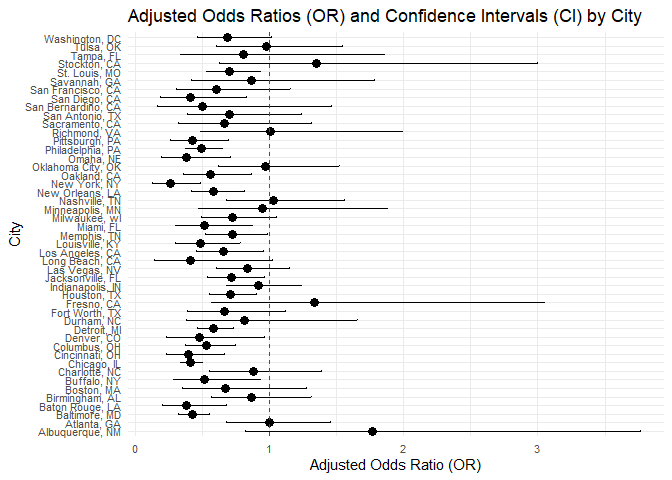

p8105_hw6_fl2714
================
Fangchi
2024-11-26

``` r
library(tidyverse)
```

    ## ── Attaching core tidyverse packages ──────────────────────── tidyverse 2.0.0 ──
    ## ✔ dplyr     1.1.4     ✔ readr     2.1.5
    ## ✔ forcats   1.0.0     ✔ stringr   1.5.1
    ## ✔ ggplot2   3.5.1     ✔ tibble    3.2.1
    ## ✔ lubridate 1.9.3     ✔ tidyr     1.3.1
    ## ✔ purrr     1.0.2     
    ## ── Conflicts ────────────────────────────────────────── tidyverse_conflicts() ──
    ## ✖ dplyr::filter() masks stats::filter()
    ## ✖ dplyr::lag()    masks stats::lag()
    ## ℹ Use the conflicted package (<http://conflicted.r-lib.org/>) to force all conflicts to become errors

``` r
library(modelr)
library(mgcv)
```

    ## 载入需要的程序包：nlme
    ## 
    ## 载入程序包：'nlme'
    ## 
    ## The following object is masked from 'package:dplyr':
    ## 
    ##     collapse
    ## 
    ## This is mgcv 1.9-1. For overview type 'help("mgcv-package")'.

``` r
library(dplyr)
library(ggplot2)
library(purrr)
library(tidyr)
```

### Problem 2

``` r
# load data
url <- "https://raw.githubusercontent.com/washingtonpost/data-homicides/master/homicide-data.csv"
homicide_data <- read.csv(url, stringsAsFactors = FALSE)
```

``` r
cleaned_data <- homicide_data %>%
  mutate(city_state = paste(city, state, sep = ", ")) %>% # create variable
  mutate(solved_binary = ifelse(disposition == "Closed by arrest", 1, 0)) %>% # whether the homicide is solved
  filter(!city_state %in% c("Dallas, TX", "Phoenix, AZ", "Kansas City, MO", "Tulsa, AL")) %>%
  filter(victim_race %in% c("White", "Black")) %>% #  limit victim_race
  mutate(
    victim_age = ifelse(victim_age == "Unknown", NA, victim_age),  
    victim_age = as.numeric(victim_age)                            
  ) %>%
  drop_na(victim_age)  
```

``` r
baltimore_data <- cleaned_data %>%
  filter(city_state == "Baltimore, MD")

glm_baltimore <- glm(solved_binary ~ victim_age + victim_sex + victim_race,
                     data = baltimore_data, family = "binomial")

baltimore_results <- broom::tidy(glm_baltimore, exponentiate = TRUE, conf.int = TRUE)

baltimore_results %>%
  filter(term == "victim_sexMale")
```

    ## # A tibble: 1 × 7
    ##   term           estimate std.error statistic  p.value conf.low conf.high
    ##   <chr>             <dbl>     <dbl>     <dbl>    <dbl>    <dbl>     <dbl>
    ## 1 victim_sexMale    0.426     0.138     -6.18 6.26e-10    0.324     0.558

``` r
baltimore_results
```

    ## # A tibble: 4 × 7
    ##   term             estimate std.error statistic  p.value conf.low conf.high
    ##   <chr>               <dbl>     <dbl>     <dbl>    <dbl>    <dbl>     <dbl>
    ## 1 (Intercept)         1.36    0.171        1.81 7.04e- 2    0.976     1.91 
    ## 2 victim_age          0.993   0.00332     -2.02 4.30e- 2    0.987     1.00 
    ## 3 victim_sexMale      0.426   0.138       -6.18 6.26e-10    0.324     0.558
    ## 4 victim_raceWhite    2.32    0.175        4.82 1.45e- 6    1.65      3.28

``` r
city_results <- cleaned_data %>%
  group_by(city_state) %>%
  nest() %>%  
  mutate(
    glm_fit = map(data, ~ glm(solved_binary ~ victim_age + victim_sex + victim_race,
                              data = ., family = "binomial")),
    tidy_results = map(glm_fit, ~ broom::tidy(.x, exponentiate = TRUE, conf.int = TRUE))
  ) %>%
  unnest(tidy_results) %>%  
  filter(term == "victim_sexMale") %>% 
  select(city_state, estimate, conf.low, conf.high)
```

    ## Warning: There were 43 warnings in `mutate()`.
    ## The first warning was:
    ## ℹ In argument: `tidy_results = map(glm_fit, ~broom::tidy(.x, exponentiate =
    ##   TRUE, conf.int = TRUE))`.
    ## ℹ In group 1: `city_state = "Albuquerque, NM"`.
    ## Caused by warning:
    ## ! glm.fit:拟合概率算出来是数值零或一
    ## ℹ Run `dplyr::last_dplyr_warnings()` to see the 42 remaining warnings.

``` r
city_results
```

    ## # A tibble: 47 × 4
    ## # Groups:   city_state [47]
    ##    city_state      estimate conf.low conf.high
    ##    <chr>              <dbl>    <dbl>     <dbl>
    ##  1 Albuquerque, NM    1.77     0.825     3.76 
    ##  2 Atlanta, GA        1.00     0.680     1.46 
    ##  3 Baltimore, MD      0.426    0.324     0.558
    ##  4 Baton Rouge, LA    0.381    0.204     0.684
    ##  5 Birmingham, AL     0.870    0.571     1.31 
    ##  6 Boston, MA         0.674    0.353     1.28 
    ##  7 Buffalo, NY        0.521    0.288     0.936
    ##  8 Charlotte, NC      0.884    0.551     1.39 
    ##  9 Chicago, IL        0.410    0.336     0.501
    ## 10 Cincinnati, OH     0.400    0.231     0.667
    ## # ℹ 37 more rows

``` r
city_results <- city_results %>%
  arrange(estimate) %>%
  mutate(city_state = factor(city_state, levels = city_state))  

ggplot(city_results, aes(x = city_state, y = estimate)) +
  geom_point() +
  geom_errorbar(aes(ymin = conf.low, ymax = conf.high), width = 0.2) +
  coord_flip() +
  labs(title = "Adjusted Odds Ratios (OR) by City",
       x = "City", y = "OR (Male vs Female Victims)") +
  theme_minimal()
```

<!-- -->
